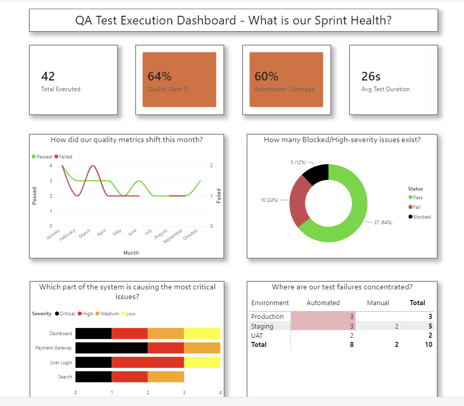

# QA Test Execution Power BI Dashboard

Objective:
To demonstrate the ability to develop a data dashboard that translates complex, raw operational data into clear, actionable intelligence for senior decision-makers. This dashboard simulates a QA environment, allowing management to track quality gate pass rates, automation coverage, and module-specific defect severity.

Key Features:

Executive KPIs: Real-time calculation of overall pass rate and automation coverage to support strategic planning.

Trend Analysis: Time-series line charts to identify if code stability is improving or degrading over sprints.

Root Cause Identification: Stacked bar charts by module to pinpoint where critical defects are concentrated, enabling targeted resource allocation.

Interactive Filtering: Slicers for Environment (Dev/Staging/UAT/Prod) and Modules to support operational decision-making in fast-changing environments.

Skills Demonstrated:

Data transformation (Power Query).

DAX measure creation for complex business logic.

Visual design principles for management consumption.

Translating technical data (test statuses, execution times) into understandable formats (rates, trends, ratios).

